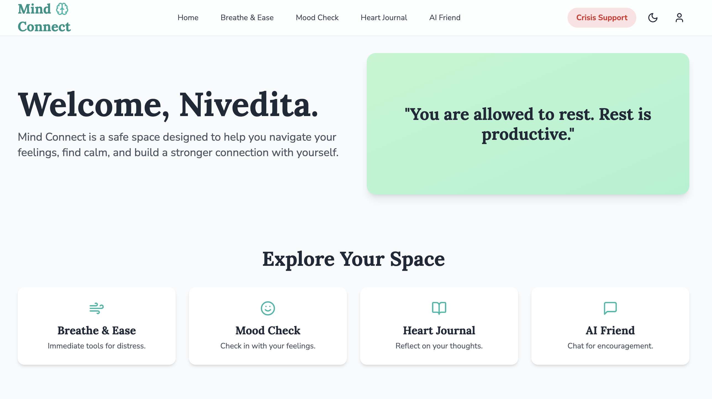
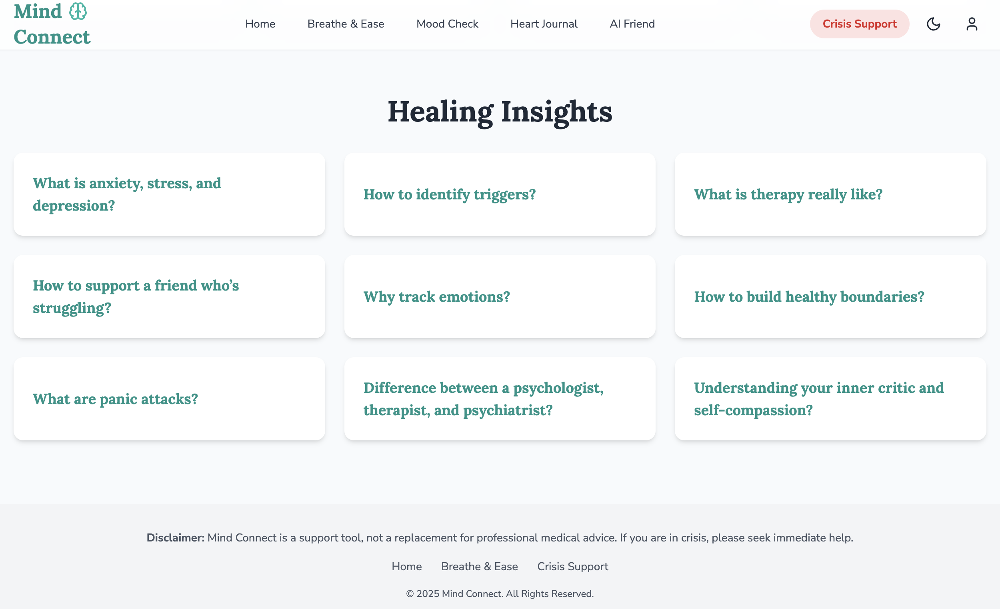
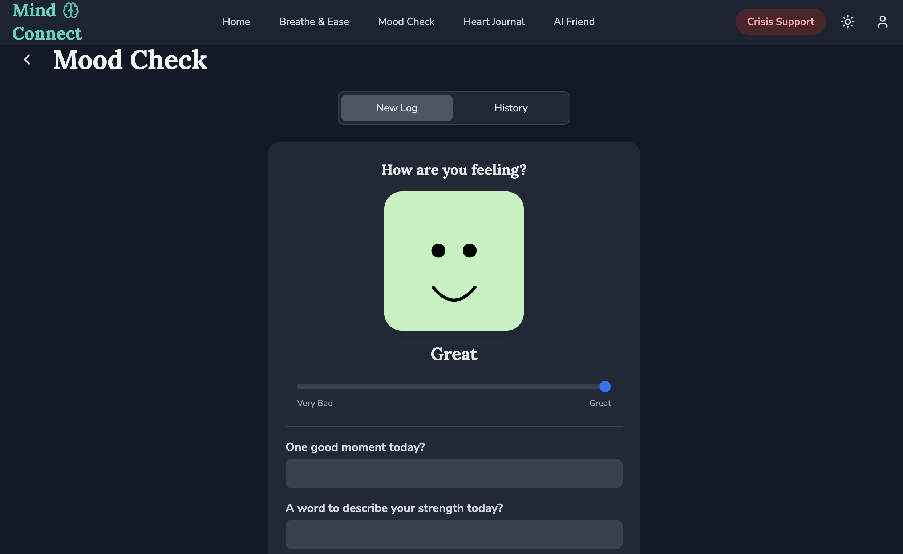
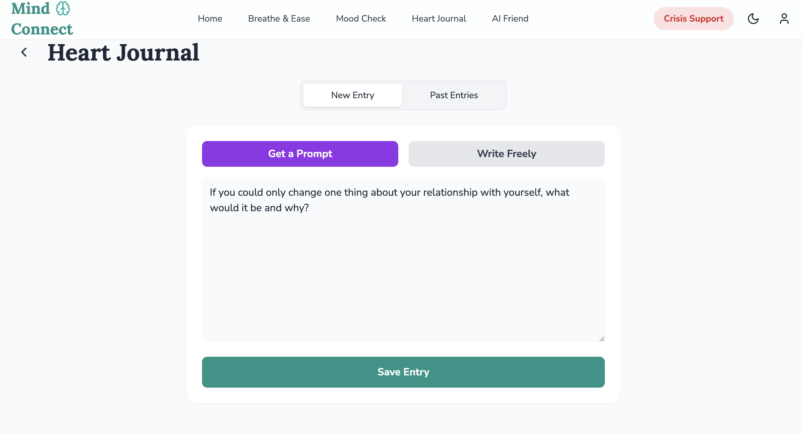
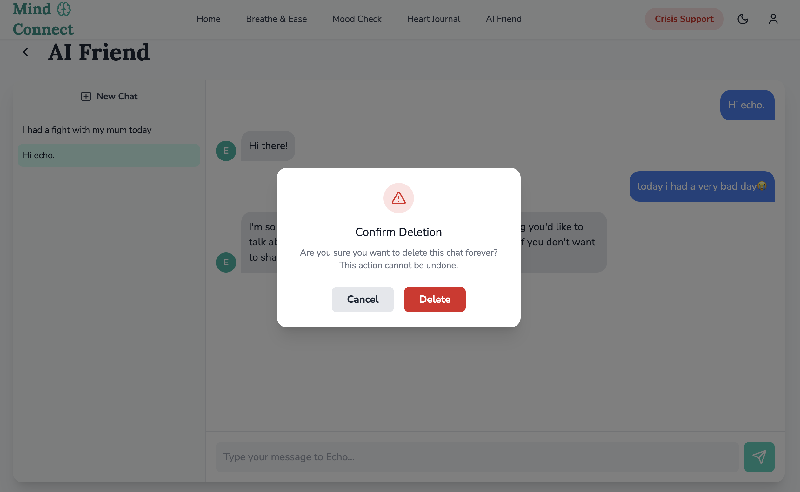

# Mind Connect - A Mental Wellness Web App 🧘‍♀️
Mind Connect is a web-based application designed to provide immediate, accessible mental health support. It offers users a private and calming digital space with tools for distress relief, self-awareness, and emotional expression. The project was built to address the need for discreet and readily available mental wellness resources.

(Note: You may want to replace this with an updated screenshot of the "Mind Connect" app)

## Core Features
- **🔐 Secure Authentication:** Full user sign-up and login functionality powered by Firebase Authentication, ensuring user data is private and secure.

- **😮‍💨 Breathe & Ease:** A collection of guided exercises for immediate distress relief, including Box Breathing, 4-7-8 Breathing, and a Meditation Timer.

- **😊 Mood Check:** A dynamic, slider-based mood logger with insightful follow-up questions to help users reflect on their emotional state. Progress is visualized on a color-coded calendar.

- **📖 Heart Journal:** A private, secure journal for users to express their thoughts freely. Includes an AI-powered prompt generator (using the Gemini API) to help overcome writer's block.

- **🤖 AI Friend (Echo):** An empathetic chatbot powered by the Gemini API that offers a safe space to share feelings and receive supportive, conversational feedback.

- **💡 Healing Insights:** A browsable grid of cards containing answers to common questions about mental health, providing accessible, bite-sized information.

- **📱 Fully Responsive Design:** A seamless and intuitive user experience on desktop, tablet, and mobile devices, built with Tailwind CSS.

## Tech Stack
- Frontend: React (with Hooks & Context API), Vite
- Styling: Tailwind CSS
- Backend & Database: Firebase (Authentication & Firestore Realtime Database)
- AI: Google Gemini API for the chatbot and journal prompt generator.
- Icons: Lucide React

## Getting Started
Follow these instructions to get a copy of the project up and running on your local machine for development and testing purposes.

**Prerequisites**
You need to have Node.js and npm installed on your computer. You can download them from [nodejs.org](https://nodejs.org/en).

**Backend Setup (Firebase)**
This application requires a Firebase project to handle user authentication and data storage.

1. Create a Firebase Project:
- Go to the [Firebase Console](https://console.firebase.google.com/u/3/) and sign in with your Google account.
- Click "Add project", give it a name, and follow the on-screen steps. You can disable Google Analytics for this project to simplify the setup.

2. Enable Authentication:
- From the left-hand menu, go to Build > Authentication.
- Click "Get started".
- In the "Sign-in method" tab, select "Email/Password" from the list, enable it, and click Save.

3. Enable Firestore Database:
- From the left-hand menu, go to Build > Firestore Database.
- Click "Create database".
- When prompted, start in Test mode. This will allow the app to read and write data during development.
- Choose a server location and click Enable.

4. Get Your Firebase Keys:
- Go back to your project's main page by clicking the gear icon ⚙️ > Project settings.
- In the "Your apps" section, click the Web icon (</>).
- Give your web app a nickname (e.g., "Mind Connect Web") and click "Register app".
- Firebase will provide you with a firebaseConfig object. Copy these keys, as you will need them in the next step.

**Frontend Setup**
1. Clone the repository:
```bash
git clone https://github.com/nivvi1106/Mind-Connect.git
```

2. Navigate to the project directory:
```bash
cd your-repo-name
```

3. Install dependencies:
```bash
npm install
```

4. Set up your environment variables:
- Create a file named .env.local in the root of your project folder.
- Paste your Firebase keys (from the Backend Setup) into this file using the following format:
```bash
VITE_FIREBASE_API_KEY="YOUR_API_KEY"
VITE_FIREBASE_AUTH_DOMAIN="YOUR_AUTH_DOMAIN"
VITE_FIREBASE_PROJECT_ID="YOUR_PROJECT_ID"
VITE_FIREBASE_STORAGE_BUCKET="YOUR_STORAGE_BUCKET"
VITE_FIREBASE_MESSAGING_SENDER_ID="YOUR_SENDER_ID"
VITE_FIREBASE_APP_ID="YOUR_APP_ID"
```

5. Start the development server:
```bash
npm run dev
```
The application will now be running on http://localhost:5173, fully connected to your private Firebase backend.








## Contributing

Contributions are welcome! If you have any suggestions, bug reports, or feature requests, please open an issue or submit a pull request.

## License
This project is licensed under the MIT License - see the [LICENSE](LICENSE) file for details.
